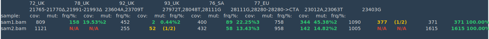

# COJAC - CoOccurrence adJusted Analysis and Calling

[](https://bioconda.github.io/recipes/cojac/README.html)
[](https://quay.io/repository/biocontainers/cojac)

## Description

The _cojac_ package comprises a set of command-line tools to analyse co-occurrence of mutations on amplicons. It is useful, for example, for finding viral variants of concern in environmental samples, and has been designed to scan for the SARS-CoV-2 variants [B.1.1.7](https://virological.org/t/preliminary-genomic-characterisation-of-an-emergent-sars-cov-2-lineage-in-the-uk-defined-by-a-novel-set-of-spike-mutations/563) and [501.V2](https://doi.org/10.1101%2F2020.12.21.20248640) in wastewater samples, as analyzed jointly by [ETH Zurich](https://bsse.ethz.ch/news-and-events/d-bsse-news/2021/01/sars-cov-2-variants-detected-in-wastewater-samples.html), [EPFL](https://actu.epfl.ch/news/covid-19-using-wastewater-to-track-the-pandemic/) and [Eawag](https://www.eawag.ch/en/department/sww/projects/sars-cov2-in-wastewater/).

The analysis requires the whole amplicon to be covered by sequencing read pairs. It currently works at the level of aligned reads, but [we plan](#upcoming-features) to be able to adjust confidence scores based on local (window) haplotypes (as generated, e.g., by [ShoRAH](https://github.com/cbg-ethz/shorah), [doi:10.1186/1471-2105-12-119](https://doi.org/10.1186/1471-2105-12-119)).

## Usage

Here are the available command-line tools:

| command                              | purpose |
| :----------------------------------- | :------ |
| [`cooc-mutbamscan`](cooc-mutbamscan) | scan an alignment BAM/CRAM/SAM file for mutation co-occurrences and output a JSON or YAML file |
| [`cooc-colourmut`](cooc-colourmut)   | display a JSON or YAML file as a coloured output on the terminal |
| [`cooc-pubmut`](cooc-pubmut)         | render a JSON or YAML file to a table as in the publication |
| [`cooc-tabmut`](cooc-tabmut)         | export a JSON or YAML file as a CSV/TSV table for downstream analysis (e.g.: RStudio) |

Use option `-h` / `--help` to see available command-line options:

```console
$ cooc-mutbamscan --help
usage: cooc-mutbamscan [-h] (-s TSV | -a BAM/CRAM [BAM/CRAM ...]) [-p PATH] [-j JSON] [-y YAML] [-t TSV] [-d]

scan amplicon (covered by long read pairs) for mutation cooccurrence

optional arguments:
-h, --help show this help message and exit
-s TSV, --samples TSV
V-pipe samples list tsv
-a BAM/CRAM [BAM/CRAM ...], --alignments BAM/CRAM [BAM/CRAM ...]
alignment files
-p PATH, --prefix PATH
V-pipe work directory prefix for where to look at align files when using TSV samples list
-j JSON, --json JSON output results to as JSON file
-y YAML, --yaml YAML output results to as yaml file
-t TSV, --tsv TSV output results to as (raw) tsv file
-d, --dump dump the python object to the terminal
```

```console
$ cooc-colourmut --help
usage: cooc-colourmut [-h] (-j JSON | -y YAML)

print coloured pretty table on terminal

optional arguments:
-h, --help show this help message and exit
-j JSON, --json JSON results generated by mutbamscan
-y YAML, --yaml YAML results generated by mutbamscan

see cooc-pubmut for a CSV file that can be imported into an article
```

```console
$ cooc-pubmut --help
usage: cooc-pubmut [-h] (-j JSON | -y YAML) [-o CSV] [-e | -x] [-q]

make a pretty table

optional arguments:
-h, --help show this help message and exit
-j JSON, --json JSON results generated by mutbamscan
-y YAML, --yaml YAML results generated by mutbamscan
-o CSV, --output CSV name of (pretty) csv file to save the table into
-e, --escape use escape characters for newlines
-x, --excel use a semi-colon ';' instead of a comma ',' in the comma-separated-files as required by Microsoft Excel
-q, --quiet Run quietly: do not print the table

you need to open the CSV in a spreadsheet that understands linebreaks
```

```console
$ cooc-tabmut --help
usage: cooc-tabmut [-h] (-j JSON | -y YAML) [-o CSV] [-x] [-m] [-q]

make a table suitable for further processing: RStudio, etc.

optional arguments:
  -h, --help            show this help message and exit
  -j JSON, --json JSON  results generated by mutbamscan
  -y YAML, --yaml YAML  results generated by mutbamscan
  -o CSV, --output CSV  name of (pretty) csv file to save the table into
  -x, --excel           use a semi-colon ';' instead of a comma ',' in the comma-separated-files as required by Microsoft Excel
  -m, --multiindex      Use multi-level indexing (amplicons and counts categories)
  -q, --quiet           Run quietly: do not print the table
```

## Howto

### Input data requirements

Analysis needs to be performed on SARS-CoV-2 samples sequenced using [ARTIC V3 protocol](https://doi.org/10.17504/protocols.io.bibtkann) (which produces ~400bp long amplicons), and sequenced with read settings that covers the totality of an amplicon (e.g.: paired end sequencing with read length 250).
NOTE: this analysis method cannot work on read length much shorter than the amplicons (e.g.: it will not give reliable results for a read-length of 50).

### Collect the co-occurrence data

There are currently two modes to collect the data about co-occurring mutations in reads: analysing stand-alone BAM/CRAM/SAM alignment files, or analysing the output of a cohort analysed with [V-pipe](https://cbg-ethz.github.io/V-pipe/) ([doi:10.1093/bioinformatics/btab015](https://doi.org/10.1093/bioinformatics/btab015)).

#### Standalone files

Provide a list of BAM files using the `-a` / `--alignment` option. Run:

```bash
cooc-mutbamscan -a sam1.bam sam2.bam -j cooc-test.json
```

> **Note:** you can also use the `-y` / `--yaml` option to write to a YAML file instead of a JSON.

#### Analyzing a cohort with V-pipe

You can learn how to analyse _fastq.gz_ files with V-pipe with this tutorial:

 - https://cbg-ethz.github.io/V-pipe/tutorial/sars-cov2/ ([video tutorial](https://youtu.be/pIby1UooK94))

Run:

```bash
cooc-mutbamscan -t work/samples.tsv -p work/samples/ -j cooc-test.json
```

### Display data on terminal

The default `-d` / `--dump` option of `cooc-mutbamscan` is not a very user-friendly experience to display the data. You can instead pass a JSON or YAML file to the display script. Run:

```bash
cooc-colourmut -j cooc-test.json
```



### Render table for publication

And now, let’s go beyond our terminal and produce a table that can be included in a publication (see bibliography below for concrete example). Run:

```bash
cooc-pubmut -j cooc-test.json -o cooc-output.tsv
```

> **Note:**
> - you can also output to comma-separated table (`-o cooc-output.csv`)
> - Microsoft Excel requires using option `-x`/`--excel` (using semi-colon instead of comma in comma-separated-value files). Some versions can also open TSV (but not the Office 365 web app).

You need to open the table with a spread-sheet that can understand line breaks, such as [LibreOffice Calc](https://www.libreoffice.org/discover/calc/), [Google Docs Spreadsheet](https://www.google.com/sheets/about/) or, using special options (see above), [Microsoft Excel](https://www.microsoft.com/en-us/microsoft-365/excel).

|          | 72_UK               | 78_UK            | 92_UK              | 93_UK               | 76_SA             | 77_EU                  |
| :------- | ------------------: | ---------------: | -----------------: | ------------------: | ----------------: | ---------------------: |
| sam1.bam | 158 / 809<br>19.53% | 2 / 452<br>0.44% | 89 / 400<br>22.25% | 344 / 758<br>45.38% | 0 / 1090<br>0.00% | 371 / 371<br>100.00%   |
| sam2.bam | 0 / 1121<br> 0.00%  | 0 / 255<br>0.00% | 58 / 432<br>13.43% | 142 / 958<br>14.82% | 0 / 1005<br>0.00% | 1615 / 1615<br>100.00% |


It is also possible to use the software [_pandoc_](https://pandoc.org/) to further convert the CSV to other formats. Run:

```bash
cooc-pubmut -j cooc-test.json -o cooc-output.csv
pandoc cooc-output.csv -o cooc-output.pdf
pandoc cooc-output.csv -o cooc-output.html
pandoc cooc-output.csv -o cooc-output.md
```

### Export table for downstream analysis

If you want to further analyse the data (e.g.: with RStudio), it's also possible to export the data into a more machine-readable CSV/TSV table. Run:

```bash
./cooc-pubmut -j cooc-test.json -o cooc-export.csv
```

You can try importing the resulting CSV in you favourite tool.

|          | A72_UK.count | A72_UK.mut_all | A72_UK.mut_oneless | A72_UK.frac | A72_UK.cooc | A78_UK.count | A78_UK.mut_all | A78_UK.mut_oneless | A78_UK.frac | A78_UK.cooc | ... |
| :------- | -----------: | -------------: | -----------------: | ----------: | ----------: | -----------: | -------------: | -----------------: | ----------: | ----------: | --- |
| sam1.bam |          809 |            158 |                234 |    0.195303 |           2 |          452 |              2 |                  7 |    0.004425 |           2 | ... |
| sam2.bam |         1121 |              0 |                  0 |    0.000000 |           2 |          255 |              0 |                 52 |    0.000000 |           2 | ... |

The columns are tagged as following:

 - **count**: total count of amplicons carrying the sites of interest 
 - **mut_all**: amplicons carrying mutations on all site of interest (e.g.: variant mutations observed on all sites)
 - **mut_oneless**: amplicons where one mutation is missing (e.g.: only 2 out of 3 sites carried the variant mutation, 1 sites carries wild-type)
 - **frac**: fraction _(mut_all/count)_ or empty if no _counts_
 - **cooc**: number of considered site (e.g.: 2 sites of interests) or empty if no _counts_
 
 If your tool supports multi-level indexing, use the `-m`/`--multiindex` option. The resulting table will be bilevel indexed:
 the first level is the amplicon, the second is the category.
 
<table>
<thead>
<tr><th></th><th colspan="5">A72_UK</th><th colspan="5">A78_UK</th></tr>
<tr><th></th><th>count</th><th>mut_all</th><th>mut_oneless</th><th>frac</th><th>cooc</th><th>count</th><th>mut_all</th><th>mut_oneless</th><th>frac</th><th>cooc</th></tr>
</thead>
<tbody>
<tr><td>sam1.bam</td><td>809</td><td>158</td><td>234</td><td>0.195303</td><td>2</td><td>452</td><td>2</td><td>7</td><td>0.004425</td><td>2</td></tr>
<tr><td>sam2.bam</td><td>1121</td><td>0</td><td>0</td><td>0.0</td><td>2</td><td>255</td><td>0</td><td>52</td><td>0.0</td><td>2</td></tr>
</tbody>
</table>

## Installation

We recommend using [bioconda software repositories](https://bioconda.github.io/index.html) for easy installation.
You can find instruction to setup your bioconda environment at the following address:

 - https://bioconda.github.io/user/install.html

In those instructions, please follow carefully the [section _2. Set up channels_](https://bioconda.github.io/user/install.html#set-up-channels).

If you use [V-pipe’s `quick_install.sh`](https://cbg-ethz.github.io/V-pipe/tutorial/sars-cov2/#install-v-pipe), it will set up an environment that you can activate, e.g.:

```bash
bash quick_install.sh -b sars-cov2 -p testing -w work
. ./testing/miniconda3/bin/activate
```

### Prebuilt package

_cojac_ and its dependencies are all available in the bioconda repository. We strongly advise you to install [this pre-built package](https://bioconda.github.io/recipes/cojac/README.html) for a hassle-free experience.

You can install _cojac_ in its own environment and activate it:

```bash
conda create -n cojac cojac
conda activate cojac
# test it
cooc-mutbamscan --help
```

And to update it to the latest version, run:

```bash
# activate the environment if not already active:
conda activate cojac
conda update cojac
```

Or you can add it to the current environment (e.g.: in environment _base_):

```bash
conda install cojac
```

### Dependencies

If you want to install the software yourself, you can see the list of dependencies in [`conda_cojac_env.yaml`](conda_cojac_env.yaml).

We recommend using conda to install them:

```bash
conda env create -f conda_cojac_env.yaml
conda activate cojac
# now run from the cojac directory
./cooc-mutbamscan --help
```

_cojac_ itself doesn't have a specific installer but you can copy its executables in your _PATH_ (so you can call them without specifying their location), e.g.: into the conda environment:

```bash
# activate the environment if not already active:
conda activate cojac
cp cooc-* ${CONDA_PREFIX}/bin/
cooc-mutbamscan --help
```

### Remove conda environment

You can remove the conda environment if you don't need it any more:

```bash
# exit the cojac environment first:
conda deactivate
conda env remove -n cojac
```

## Additional notebooks

The subdirectory [`notebooks/`](notebooks/) contains Jupyter and Rstudio notebooks used in the [publication](#citation).

## Upcoming features

- [x] ~~bioconda package~~
- [ ] further jupyter and rstudio code from the publication
- [ ] Move hard-coded amplicons to BED input file
- [ ] Move hard-coded mutations to YAML configuration

Long term goal:

- [ ] Integration with ShoRAH amplicons

## Contributions

#### Package developers:

- [David Dreifuss ![orcid ]](https://orcid.org/0000-0002-5827-5387), [![github]](https://github.com/dr-david)
- [Ivan Topolsky ![orcid]](https://orcid.org/0000-0002-7561-0810), [![github]](https://github.com/dryak)

#### Additional notebooks:

 - [Lara Fuhrmann ![orcid]](https://orcid.org/0000-0001-6405-0654), [![github]](https://github.com/LaraFuhrmann)
 - [Katharina Jahn ![orcid]](https://orcid.org/0000-0002-6983-4615), [![github]](https://github.com/jahnka)

#### Corresponding author:

 - [Niko Beerenwinkel ![orcid]](https://orcid.org/0000-0002-0573-6119)

[github]: images/mark-github.svg
[orcid]: images/ORCIDiD_iconvector.svg


## Citation

If you use this software in your research, please cite:

- Katharina Jahn, David Dreifuss, Ivan Topolsky, Anina Kull, Pravin Ganesanandamoorthy, Xavier Fernandez-Cassi, Carola Bänziger, Elyse Stachler, Lara Fuhrmann, Kim Philipp Jablonski, Chaoran Chen, Catharine Aquino, Tanja Stadler, Christoph Ort, Tamar Kohn, Timothy R. Julian, Niko Beerenwinkel

  "*Detection of SARS-CoV-2 variants in Switzerland by genomic analysis of wastewater samples*."

  medRxiv 2021.01.08.21249379; [doi:10.1101/2021.01.08.21249379](https://doi.org/10.1101/2021.01.08.21249379)

## Contacts

If you experience problems running the software:

- We encourage to use the [issue tracker on GitHub](https://github.com/cbg-ethz/cojac/issues)
- For further enquiries, you can also contact the [V-pipe Dev Team](https://cbg-ethz.github.io/V-pipe/contact/)
- You can contact the publication’s corresponding author
